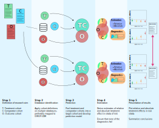

RiskStratifiedEstimation
===========

<!-- badges: start -->
  [](https://github.com/OHDSI/RiskStratifiedEstimation/actions/workflows/R-CMD-check.yaml)
  [](https://codecov.io/github/OHDSI/RiskStratifiedEstimation?branch=19-implement-testing)
  <!-- badges: end -->

Introduction
============
RiskStratifiedEstimation is an R package for implementing risk stratified
analyses for the assessment of treatment effect heterogeneity in an
observational database in the OMOP Common Data Model. The package combines
functionality of
[PatientLevelPrediction](https://github.com/OHDSI/PatientLevelPrediction) and
[CohortMethod](https://github.com/OHDSI/CohortMethod) R packages.

The framework is applied in 5 steps:
1. *Definition of the research problem*: Requires the definition of (at
   least) three cohorts. The **treatment cohort** with instructions on which
   patients are to be considered as receiving the treatment of interest; the
   **comparator cohort** with instructions on which patients are to be
   considered as receiving the comparator treatment; one (or more) **outcome
   cohort(s)** with instructions on which patients are to be considered as
   having the outcome(s) of interest.
2. *Database identification*: Databases mapped to OMOP-CDM on which the cohort
   definitions will be applied in order to generate the study population.
3. *Prediction*: Develop one (or more) prediction model(s) on the outcome(s) of
   interest on the pooled treatment and comparator cohorts in each database.
4. *Estimation*: Run diagnostincs and derive estimates of both relative and
   absolute treatment effects within strata of predicted risk.
5. *Presentation of results*: Plot relative and absolute treatment effect
   estimates derived on all databases and summarize.


  
Features
========
- Extracts the necessary data from a database in OMOP Common Data Model format.
- Uses a large set of covariates for the prediction, the propensity and the outcome model, including for example all drugs, diagnoses, procedures, as well as age, comorbidity indexes, etc.
- Imports functionality from [PatientLevelPrediction](https://github.com/OHDSI/PatientLevelPrediction) package for the development of prediction models for risk stratification.
- Large scale regularized regression to fit the propensity and outcome models.
- Includes diagnostic functions for the prediction process, including calibration plots and ROC curves demostrating the performance of the developed prediction models in sub-populations of interest.
- Includes diagnostic functions for the estimation process, including propensity score distribution plots and plots showing covariate balance before and after performing a propensity score-based analysis.

Technology
============
RiskStratifiedEstimation is being developed in R.

System Requirements
============
Requires R (version 3.1.0 or higher). Installation on Windows requires [RTools](http://cran.r-project.org/bin/windows/Rtools/). Libraries used in RiskStratifiedEstimation require Java.

Dependencies (HADES)
============
 * Cyclops
 * DatabaseConnector
 * SqlRender
 * FeatureExtraction
 * ParallelLogger
 * CohortMethod
 * PatientLevelPrediction
 * EmpiricalCalibration

Getting Started
===============
1. On Windows, make sure [RTools](http://cran.r-project.org/bin/windows/Rtools/) is installed.
2. The DatabaseConnector and SqlRender packages require Java. Java can be downloaded from
<a href="http://www.java.com" target="_blank">http://www.java.com</a>. Once Java is installed, ensure that Java is being pathed correctly. Under environment variables in the control panel, ensure that the jvm.dll file is added correctly to the path.
3. In R, use the following commands to download and install RiskStratifiedEstimation:

  ```r
  install.packages("remotes")
  remotes::install_github("OHDSI/RiskStratifiedEstimation")
  ```

Getting Involved
=============
* Vignette: [Study example](https://github.com/mi-erasmusmc/RiskStratifiedEstimation/tree/develop/inst/doc/StudyExample.pdf)
* Package manual: [RiskStratifiedEstimation.pdf](https://github.com/mi-erasmusmc/RiskStratifiedEstimation/blob/develop/extras/RiskStratifiedEstimation-manual.pdf)
* Developer questions/comments/feedback: <a href="http://forums.ohdsi.org/c/developers">OHDSI Forum</a>
* We use the <a href="https://github.com/OHDSI/RiskStratifiedEstimation/issues">GitHub issue tracker</a> for all bugs/issues/enhancements

License
=======
RiskStratifiedEstimation is licensed under Apache License 2.0

Development
===========
RiskStratifiedEstimation is being developed in R Studio.

RiskStratifiedEstimation is still in beta phase.


