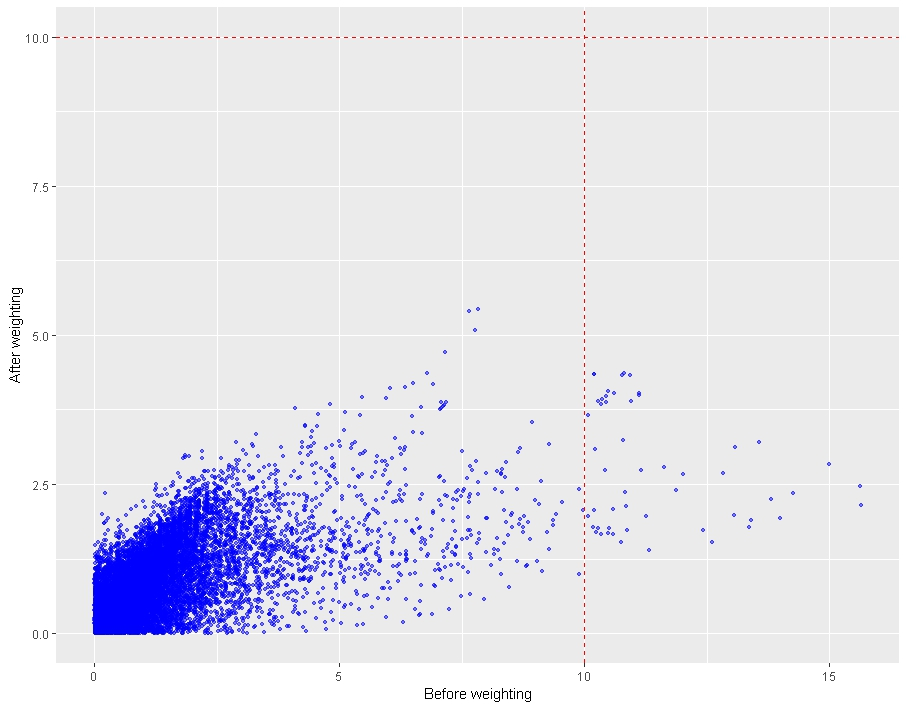
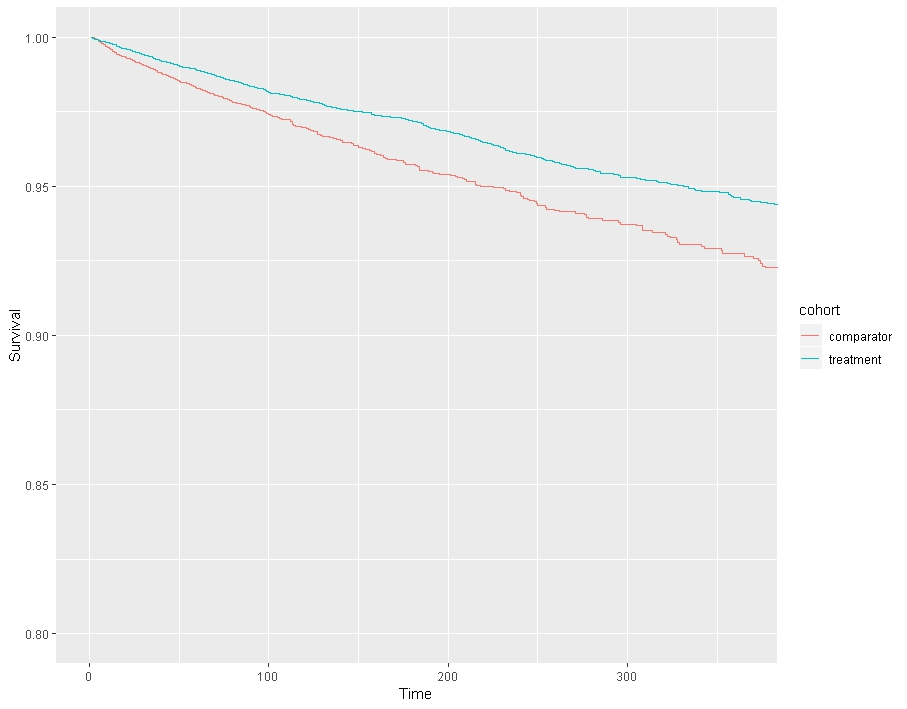
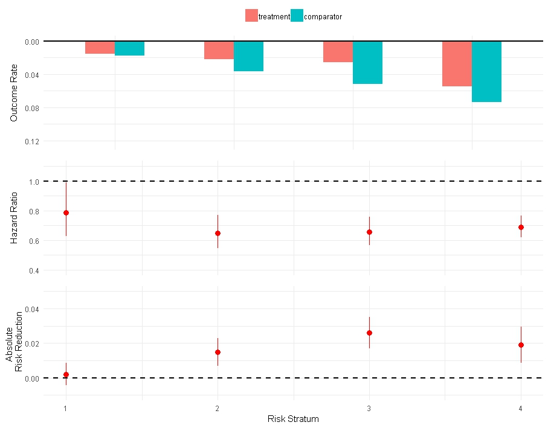

```{r, echo = FALSE, message = FALSE, warning = FALSE}
options(width=200)
library(CohortMethod)
knitr::opts_chunk$set(
  cache=FALSE,
  comment = "#>",
  error = FALSE,
  tidy = FALSE)
```

# Introduction
This vignette describes the application of a risk modeling approach to predictive heterogeneity of treatment effect (HTE) using the `RiskStratifiedEstimation` package. More specifically, this method involves stratifying the population into strata of predicted risk and performing comparisons of relative and absolute measures of treatment effect within these risk strata. Our package combines functionality of the `CohortMethod` and the `PatientLevelPrediction` packages to perform such a risk stratified effect estimation (RSEE) analysis. To date, only time to event response variables are conisdered. We will walk through all the important steps needed to perform an exemplar study. For the demonstration we will consider the comparison of coxibs to non-steroidal anti-inflammatory drugs (NSAIDs) in arthritis patients with established cardiovascular disease with respect to clinically sigificant gastrointestinal events (CSGIE). For simplicity we focus only in one coxib -- celecoxib -- and one non-selective NSAID -- naproxen.

# Installation instructions

# Data extraction

```{r tidy=FALSE, eval=FALSE}
connectionDetails <- DatabaseConnector::createConnectionDetails(dbms = "postgresql",
                                             server = "localhost/ohdsi",
                                             user = "joe",
                                             password = "supersecret")

cdmDatabaseSchema <- "my_cdm_data"
```

Covariate settings are defined using
```{r eval = FALSE}
covariateSettings <-
  createCovariateSettings(
    useDemographicsGender = TRUE,
    useDemographicsAgeGroup = TRUE,
    useDemographicsIndexMonth = TRUE,
    useConditionOccurrenceLongTerm = TRUE,
    useDrugExposureLongTerm = TRUE,
    useProcedureOccurrenceLongTerm = TRUE,
    useMeasurementLongTerm = TRUE,
    useCharlsonIndex = TRUE,
    useDistinctConditionCountLongTerm = TRUE,
    useDistinctIngredientCountLongTerm = TRUE,
    useDistinctProcedureCountLongTerm = TRUE,
    useDistinctMeasurementCountLongTerm = TRUE,
    useVisitCountLongTerm = TRUE,
    longTermStartDays = -365,
    mediumTermStartDays = -180,
    shortTermStartDays = -30,
    endDays = 0,
    excludedCovariateConceptIds = list(1118084, 1115008),
    addDescendantsToExclude = TRUE
  )
```
There are many parameters, but they are all documented in the `CohortMethod` manual. The `createCovariateSettings` function is described in the `FeatureExtraction` package.

**IMPORTANT:** Make sure to remove the drugs from the covariates in order to avoid including them in the prediction step. In this case, we remove the ingredients (1118084 for celecoxib and 1115008 for naproxen) and all their descendants from the covariate settings.

```{r eval = FALSE}
cohortMethodData <- 
  getDbCohortMethodData(connectionDetails = connectionDetails,
                        cdmDatabaseSchema = cdmDatabaseSchema,
                        oracleTempSchema = NULL,
                        targetId = 5613,
                        comparatorId = 5614,
                        outcomeIds = 5622,  
                        studyStartDate = '',
                        studyEndDate = '',
                        exposureDatabaseSchema = cdmDatabaseSchema,
                        exposureTable = 'cohort',
                        outcomeDatabaseSchema = cdmDatabaseSchema,
                        outcomeTable = 'cohort',
                        cdmVersion = '5',
                        excludeDrugsFromCovariates = FALSE,
                        firstExposureOnly = FALSE,
                        removeDuplicateSubjects = TRUE,
                        restrictToCommonPeriod = FALSE,
                        washoutPeriod = 0,
                        covariateSettings = covariateSettings)
```
# Define study population

```{r eval = FALSE}
populationCSGIE <- createStudyPopulation(cohortMethodData = cohortMethodData,
                                         outcomeId = 5622,
                                         firstExposureOnly = TRUE, 
                                         restrictToCommonPeriod = FALSE,
                                         washoutPeriod = 0, 
                                         removeDuplicateSubjects = 'remove all',
                                         removeSubjectsWithPriorOutcome = FALSE, 
                                         riskWindowEnd = 30,
                                         addExposureDaysToEnd = TRUE, 
                                         minDaysAtRisk = 1)
```
Note that we’ve set `firstExposureOnly` to TRUE to get only the first of the recorded exposures. We set `removeDuplicateSubjects` to 'remove all', and `washoutPeriod` to zero because we already filtered on these arguments when using the `getDbCohortMethodData` function.
During loading we set `restrictToCommonPeriod` to FALSE, and we do the same here because we do not want to force the comparison to restrict only to time when both drugs are recorded. We specify the outcome ID we
will use, and that people with outcomes prior to the risk window start date will not be removed. The risk window
is defined as starting at the index date (`riskWindowStart` = 0 and `addExposureDaysToStart` = FALSE),
and the risk windows ends 30 days after exposure ends (`riskWindowEnd` = 30 and `addExposureDaysToEnd`
= TRUE). Note that the risk windows are truncated at the end of observation or the study end date. We also
remove subjects who have no time at risk. 

# Running an RSEE analysis
To run an RSEE analysis two steps need to be performed. First, a prediction step where the individual patient risks are estimated. These estimates are used to stratify patients into strata with similar risk. In the second step, treament effect estimates are calculated within the risk strata. In our case, these steps are performed by calling the following function:

```{r eval = FALSE}
modelSettings <-
  PatientLevelPrediction::setLassoLogisticRegression(variance = 0.01,
                                                     seed = NULL)

result <- runRiskStratifiedEstimation(cohortMethodData = cohortMethodData, 
                                      population = populationCSGIE, 
                                      modelSettings = modelSettings,
                                      nfold = 10,
                                      testSplit = 'person',
                                      testFraction = 0.3,
                                      savePlpPlots = TRUE,
                                      save = 'save_folder',
                                      riskStrata = 4,
                                      weightsType = 'ATE',
                                      useStabilizedWeights = TRUE,
                                      truncationLevels = c(.025, .975),
                                      timePoint = 365,
                                      psThreads = 4)

```

## Prediction step
In this section we demonstrate how to tune the `runRiskStratifiedEstimation` function to the desired prediction settings. First, we need to decide which prediction method we are going to use. In this specific case, we have selected a LASSO logistic regression approach. However, one can select any of the several other approaches described in the `PatientLevelPrediction` package vignettes. Next, we need to define the number of folds for tuning the hyperparameters of the prediction algorithm. In our case we have set this number to 10. Here, we also split the data in a 70%-30% split, where 70% of the data are used for training the LASSO regression model and 30% is used for evaluating its performance. This split is based on a random selection of patient IDs (`testSplit` = "person"). Finally, one can choose to generate the default plots provided by the  `PatientLevelPrediction` package. Note that the result of the RSEE analysis provides the prediction result, allowing for further processing, after the run is finished. For more information, consult the `PatientLevelPrediction` [manual and vignettes](https://github.com/OHDSI/PatientLevelPrediction).

## Estimation step
In this section we demonstrate the tuning of the estimation step of our process. Using the risk estimates of the prediction step described earlier, we can stratify patients into groups based on the quantiles of the prediction distribution. Here we divide patients into quartiles of predicted risk (`riskStrata` = 4). Since treatment assignment is not random within risk strata, we need to estimate propensity scores and apply one of the several available methods in the literature to balance the covariates. To date, only the inverse probability of treatment weighting approach can be considered in the package. This means that patients are weighted by the inverse of the probability to receive the treamtent they actually received. Two weighting schemes are allowed, i.e. "ATE" that allows the estimation of the average treatment effect and "ATT" that allows the estiamtion of the average treatment effect on the treated. In order to deal with the presence of very large weights, we allow for stabilization (`useStabilizedWeights` = TRUE). Finally, fixed truncation of the weights can be also considered in order to set an upper and a lower bound to the permitted size of the weights. We define these bounds using quantiles of the weight distribution. here, these bouds are the 2.5% and the 97.5% quantiles.

As was mentioned earlier, only time to event response data can be analyzed with the package. We need to define a period of follow-up for our study, which in this case, this period is one year (`timePoint` = 365). The `runRiskStratifiedEstimation` function fits a weighted Cox proportional hazards model to generate unbiased estimates of the hazard ratios within risk strata. It also generates weighted Kaplan-Meier estimates within risk strata. 

We can allow for parallelization of the propensity score estimation, which tends to be rather slow when the size of the data is large. In this case we set the threads to 4, one thread for each risk stratum.

Finally, we can save the result of the analysis to a selected folder. This folder will then include the prediction result, the hazard ratios within risk strata along with 95% confidence intervals, the weighted Kaplan-Meier estimates within risk strata and the propensity scores. 

# Plots
The `RiskStratifiedEstimation` package allows for the construction of several plots. We have already mentioned that we can obtain the default plots provided from the `PatientLevelPrediction` package for model evaulation. Additionally, we can derive the propensity score diagnostics described in the `CohortMethod` package vignette.

## Balance diagnostics

Using the code presented below we can plot the covariate balance in the weighted population of the 4th (highest) risk stratum.

```{r eval = FALSE}
plotCovariateBalance(ps = result$ps[[4]],
                     cohortMethodData = cohortMethodData,
                     calculateWeights = FALSE,
                     showNotBalancedCovariateIds = TRUE)
```

## Weighted Kaplan-Meier

Using the code presented below we can produce plots of the weighted Kaplan-Meier estimates within risk strata. The time interval of interest is one year (365 days). Again, we consider the case of the 4th risk stratum. 

```{r eval = FALSE}
plotWeightedKM(dataKM = result$dataKM[[4]], 
               xlim = c(0, 365), 
               ylim = c(.7, 1),
               ci = FALSE)
```
```{r echo = FALSE, message = FALSE, eval = TRUE}
if(file.exists('S:\\arekkas\\celecoxib-naproxen-vignette\\20180924053516 RSEE\\dataKM.rds')){
  dataKM <- readRDS('S:\\arekkas\\celecoxib-naproxen-vignette\\20180924053516 RSEE\\dataKM.rds')
  plotWeightedKM(dataKM = result$dataKM[[4]], 
               xlim = c(0, 365), 
               ylim = c(.7, 1),
               ci = FALSE)
}


```

## Analysis result

Finally, we can produce an analysis summary plot using the code below. This plot contains the outcome rates in the propensity weighted populations along with the absolute and relative (hazard ratios) risk differences.
```{r eval = FALSE}
comparisonPlot(dataARR = result$absoluteRiskReduction, 
               dataRRR = result$relativeRiskReduction,
               cases = result$cases,
               ylimRRR = c(.4, 1.1), 
               ylimARR = c(-.01, .05),
               ylimCases = c(0, .125))
```
```{r eval = TRUE, message = FALSE, echo = FALSE}
if(file.exists('S:\\arekkas\\celecoxib-naproxen-vignette\\20180924053516 RSEE\\absoluteRiskReduction.rds')&
   file.exists('S:\\arekkas\\celecoxib-naproxen-vignette\\20180924053516 RSEE\\relativeRiskReduction.rds')&
   file.exists('S:\\arekkas\\celecoxib-naproxen-vignette\\20180924053516 RSEE\\cases.rds')){
  
  
  dataKM <- readRDS('S:\\arekkas\\celecoxib-naproxen-vignette\\20180924053516 RSEE\\dataKM.rds')
  relativeRiskReduction <- readRDS('S:\\arekkas\\celecoxib-naproxen-vignette\\20180924053516 RSEE\\relativeRiskReduction.rds')
  absoluteRiskReduction <- readRDS('S:\\arekkas\\celecoxib-naproxen-vignette\\20180924053516 RSEE\\relativeRiskReduction.rds')
  cases <- readRDS('S:\\arekkas\\celecoxib-naproxen-vignette\\20180924053516 RSEE\\cases.rds')
  comparisonPlot(dataARR = absoluteRiskReduction, 
                 dataRRR = relativeRiskReduction,
                 cases = cases,
                 ylimRRR = c(.4, 1.1), 
                 ylimARR = c(-.01, .05),
                 ylimCases = c(0, .125))
}

```
We can use such a plot to provide insight to the presence of HTE and draw useful conclusions on treatment assignment.
