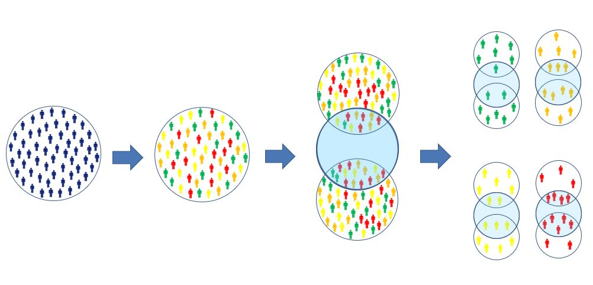
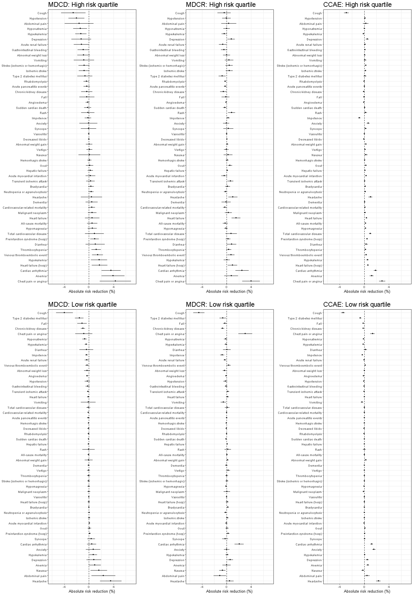

```{r, echo = FALSE, message = FALSE, warning = FALSE}
options(width=200)
library(CohortMethod)
knitr::opts_chunk$set(
  cache=FALSE,
  comment = "#>",
  error = FALSE,
  tidy = FALSE)
```

# Introduction
Generalizability of an overall result found in a study and applicability to a specific patient move in opposite directions. When patients differ from one another in many key determinants of the outcome of interest--and consequently in the potential benefits and harms of therapy--it can be unclear to whom the overall average benefit-harm trade-offs actually apply. Precision medicine aims to tailor treatment to individual patients. As such, analysis of heterogeneity of treatment effect (HTE), i.e. non-random variation in the direction or magnitude of a treatment effect for individuals within a population, is the cornerstone of precision medicine; its goal is to predict the optimal treatments at the individual level, accounting for an individual’s risk for harm and benefit outcomes.

This vignette describes the application of a risk modeling predictive approach to the assessment of treatment effect heterogeneity (HTE) using the `RiskStratifiedEstimation` package. The method involves 4 main steps summarized in Figure \ref{workflow}:

- **Definition of the problem:** For this step we need to define (at least) 3 essential cohorts: (1) the treatment cohort, containing the set of patients receiving the treatment treatment interest; (2) the comparator cohort, containing the set of patients receiving the comparator cohort; (3) the outcome cohort(s), containing the set of patients having the outcome(s) of interest.
- **Identification of the database:** We need to define the database(s) on which we will assess treatment effect heterogeneity. We need to make sure that the cohorts created contain enough patients to proceed with the application of the method.
- **Prediction step:** Combine the treatment and comparator cohorts into a single cohort for prediction and then provide the settings required for prediction based on the `PatientLevelPrediction` package. This means that we need to define the time-at-risk (time interval within which we want to predict), the set of predictive covariates and the prediction algorithm to be used (along with its settings).
- **Estimation step:** Divide the treatment population in a pre-specified number of equal-sized strata based on baseline risk and estimate the absolute and relative treatment effects.




# Study specification and database selection
For the current demonstration we consider some of the treatments and outcomes assessed in the Large-scale Evidence Generation in Network of Databases (LEGEND) study for hypertension. The treatment cohort contains patients with a hypertension diagnosis within the database that receive angiotensin-converting enzyme (ACE) inhibitors, followed from the time of initiation until the time of cessation. The comaparator cohort contains the set of patients within the database with a hypertension diagnosis that receive beta blockers. We also consider 2 outcome cohorts. The first contains all patients found in the database that have at least one occurrence of cardiovascular disease (CVD). The second contains all patients with an occurrence of cough. We consider CVD as the main outcome of interest that we are trying to prevent in the study and cough as a common side-effect of ACE-inhibitors. Cohort definitions are available online [here](https://github.com/OHDSI/Legend).

After the defining the problem we need to define the database on which we will assess treatment effect heterogeneity. We need to make sure that the defined cohorts are of adequate size to perform the analysis. This is relevant to all cohorts defined. Very small treatment or comparator cohorts reduce the power of our analyses restricting the minimum detectable differences. Due to the stratified approach of the framework this aspect is very relevant. The size of the outcome cohorts is also very important for both the prediction and the estimation steps. In the former case, low events per variable may limit the prediction performance, while in the latter case, risk stratification may result to in very few or even no observed cases in the lower strata.

# Study implementation

## Cohort instantiation
Similar to PLP package

## Study script creation
In this section we assume that our cohorts have been created and have been extracted using a specific database. Then  we can proceed with the creation of the script that will perform the defined study. For this part 7 types of input need to be created:

- connection details
- anlaysis settings
- database settings
- Settnigs for getting the data
- covariate settings
- population settings
- run settings

### Analysis settnigs
The analysis settings refer to information that define the structure of the study and can be used to identify it. The analysis id is a--pereferably--unique identifier of the present study. The treatment cohort id refers to the unique identifier of the treatment cohort definition. In our case, that is $1001$ and refers to the extracted hypertensive patients receving ACE-inhibitors. The comparator cohort id refers to the unique identifier of the comparator cohort. In our case this is $1002$ and refers to the extracted cohort of hypertensive patients receiving beta blockers; the outcome ids that refer to the unique identifiers of the outcome cohorts. A very important characteristic of the analysis settings is the analysis matrix, that dictates which comparisons are to be made. The columns of this square boolean matrix refer to risk stratification outcomes and the rows to estimation outcomes. Therefore, the default diagonal matrix defines the following analyses:

- Within strata of CVD risk estimate relative and absolute treatment effects of CVD events.
- Within strata of cough risk estimate relative and absolute treatment effects of coughing events.

We can create the analysis settings using the following code:

```{r tidy=FALSE, eval=FALSE}
analysisSettings <- createAnalysisSettings (
  analysisId = "vignette_demonstration",
  treatmentCohortId = 1001,
  comparatorCohortId = 1002,
  outcomeIds = c(134, 153),
  analysisMatrix = diag(2)),
verbosity = "INFO",
saveDirectory = "path/to/save/directory"
)
```


### Connection details
We need to define our connection details that will be used to connect to the database we have access to in order to construct extract the data objects required for our analyses. They can be created from:

```{r tidy=FALSE, eval=FALSE}
connectionDetails <- DatabaseConnector::createConnectionDetails(
  dbms = dbms,
  server = server,
  user = "joe",
  password = "secret",
  port = port
)
```

### Database settings
The database settings contain relevant information on the database we want to access. These refer to the database schema based on which we extract our data along with the tables where the cohorts of interest are stored. Note that we also need to create a table containing the merged treatment and comparator cohorts that will be used to derive the prediction models (requires write permission). Database settings can be created from:

```{r tidy=FALSE, eval=FALSE}
databaseSettings <- createDatabaseSettings(
  cdmDatabaseSchema = "cdm_truven_mdcd_v780.dbo",
  cohortDatabaseSchema = "Scratch.dbo",
  outcomeDatabaseSchema = "Scratch.dbo",
  resultsDatabaseSchema = "Scratch.dbo",
  exposureDatabaseSchema = "Scratch.dbo",
  cohortTable = "ace_beta_cohorts",
  outcomeTable = "ace_beta_outcomes",
  exposureTable = "ace_beta_cohorts",
  mergedCohortTable = "ace_beta_merged",
  attributeDefinitionTable = "ace_beta_def",
  cohortAttributeTable = "ace_beta_attr"
)
```

### Settings for getting the data
There are two data objects that need to be defined. The prediction data object that will be used for the derivation of the prediction models used to risk stratify patients and the estimation data object that will be used to estimate propensity scores and estimate treatment effects within risk strata.

```{r tidy=FALSE, eval=FALSE}
getDataSettings <- createGetDataSettings(
  getPlpDataSettings = createGetPlpDataArgs(
    washoutPeriod = 365
  ),
  getCmDataSettings = createGetCmDataArgs(
    washoutPeriod = 365
  )
)
```

### Covariate settings
The purpose of the covariate settings is twofold. In the prediction step they define the set of candidate predictors for the develppment of the model. In the estimation step they define the set of candidate confounders to be considered for the esitmation of the propensity scores. In both cases we use the same covariate settings using a large set of standardized covariates:

```{r tidy=FALSE, eval=FALSE}
covariateSettings <- createGetCovariateSettings(
  covariateSettingsCm = FeatureExtraction::createCovariateSettings(
    useDemographicsGender = TRUE,
    useDemographicsAge = TRUE,
    useConditionOccurrenceLongTerm = TRUE,
    useConditionOccurrenceShortTerm = TRUE,
    useDrugExposureLongTerm = TRUE,
    useDrugExposureShortTerm = TRUE,
    useDrugEraLongTerm = TRUE,
    useDrugEraShortTerm = TRUE,
    useCharlsonIndex = TRUE,
    addDescendantsToExclude = TRUE,
    excludedCovariateConceptIds = 
      excludedCovariateConceptIds,
    addDescendantsToInclude = TRUE
  ),
  covariateSettingsPlp = FeatureExtraction::createCovariateSettings(
    useDemographicsGender = TRUE,
    useDemographicsAge = TRUE,
    useConditionOccurrenceLongTerm = TRUE,
    useConditionOccurrenceShortTerm = TRUE,
    useDrugExposureLongTerm = TRUE,
    useDrugExposureShortTerm = TRUE,
    useDrugEraLongTerm = TRUE,
    useDrugEraShortTerm = TRUE,
    useCharlsonIndex = TRUE,
    addDescendantsToExclude = TRUE
  )
)
```

### Population settings
The population settings contain additional restrictions for the definitive target populations. Again in this case we need to define the target population in the prediction step, based on which we will actually develop the prediction models. In the estimation step the population settings will define the population from which the propensity score models will be derived and the treatment effects will be estimated. The final populations may contain slightly different patients. We can define the population settings from:

```{r tidy=FALSE, eval=FALSE}
populationSettings <- createPopulationSettings(
  populationPlpSettings = createPopulationPlpSettingsArgs(
    riskWindowEnd = 365,
    minTimeAtRisk = 364
  ),
  populationCmSettings = createPopulationCmSettingsArgs(
    removeDuplicateSubjects = "keep first",
    removeSubjectsWithPriorOutcome = TRUE,
    riskWindowStart = 1,
    riskWindowEnd = 9999,
    addExposureDaysToEnd = FALSE,
    minDaysAtRisk = 1
  )
)

```

### Run settings
Finally, we need to define the settings based on which the algorithms in the prediction and estimation steps will be run. For example, in the prediction step we need to define the prediction algorithm to be used along with the hyperparameter parameter search strategy. In the estimation step some of the settings we need to define the propensity score method to be used for the estimation of the effects within risk strata or the time point at which we will assess absolute and relative risk differences. Since we mostly deal with time-to-event data this means that absolute risk reduction is esimtated absed on the difference on the Kaplan-Meier estimates at the specific time point. The run settings can be created from:

```{r tidy=FALSE, eval=FALSE}
runSettings <- createRunSettings(
  runPlpSettings = createRunPlpSettingsArgs(),
  runCmSettings = createRunCmSettingsArgs(
    psMethod = "inversePtWeighted",
    effectEstimationSettings = createCreateIPWArgs(),
    psSettings = createCreatePsArgs(),
    fitOutcomeModelsThreads = 2,
    timePoint = 365
  )
)

```

# Plots
The `RiskStratifiedEstimation` package allows for the construction of several plots. We have already mentioned that we can obtain the default plots provided from the `PatientLevelPrediction` package for model evaulation. Additionally, we can derive the propensity score diagnostics described in the `CohortMethod` package vignette.

## Balance diagnostics

Using the code presented below we can plot the covariate balance in the weighted population of the 4th (highest) risk stratum.

```{r eval = FALSE}
plotCovariateBalance(ps = result$ps[[4]],
                     cohortMethodData = cohortMethodData,
                     calculateWeights = FALSE,
                     showNotBalancedCovariateIds = TRUE)
```

## Weighted Kaplan-Meier

Using the code presented below we can produce plots of the weighted Kaplan-Meier estimates within risk strata. The time interval of interest is one year (365 days). Again, we consider the case of the 4th risk stratum. 

```{r eval = FALSE}
plotWeightedKM(dataKM = result$dataKM[[4]], 
               xlim = c(0, 365), 
               ylim = c(.7, 1),
               ci = FALSE)
```
```{r echo = FALSE, message = FALSE, eval = TRUE}
if(file.exists('S:\\arekkas\\celecoxib-naproxen-vignette\\20180924053516 RSEE\\dataKM.rds')){
  dataKM <- readRDS('S:\\arekkas\\celecoxib-naproxen-vignette\\20180924053516 RSEE\\dataKM.rds')
  plotWeightedKM(dataKM = result$dataKM[[4]], 
               xlim = c(0, 365), 
               ylim = c(.7, 1),
               ci = FALSE)
}
```

## Analysis result

Finally, we can produce an analysis summary plot using the code below. This plot contains the outcome rates in the propensity weighted populations along with the absolute and relative (hazard ratios) risk differences.
```{r eval = FALSE}
comparisonPlot(dataARR = result$absoluteRiskReduction, 
               dataRRR = result$relativeRiskReduction,
               cases = result$cases,
               ylimRRR = c(.4, 1.1), 
               ylimARR = c(-.01, .05),
               ylimCases = c(0, .125))
```
```{r eval = TRUE, message = FALSE, echo = FALSE}
if(file.exists('S:\\arekkas\\celecoxib-naproxen-vignette\\20180924053516 RSEE\\absoluteRiskReduction.rds')&
   file.exists('S:\\arekkas\\celecoxib-naproxen-vignette\\20180924053516 RSEE\\relativeRiskReduction.rds')&
   file.exists('S:\\arekkas\\celecoxib-naproxen-vignette\\20180924053516 RSEE\\cases.rds')){
  
  
  dataKM <- readRDS('S:\\arekkas\\celecoxib-naproxen-vignette\\20180924053516 RSEE\\dataKM.rds')
  relativeRiskReduction <- readRDS('S:\\arekkas\\celecoxib-naproxen-vignette\\20180924053516 RSEE\\relativeRiskReduction.rds')
  absoluteRiskReduction <- readRDS('S:\\arekkas\\celecoxib-naproxen-vignette\\20180924053516 RSEE\\relativeRiskReduction.rds')
  cases <- readRDS('S:\\arekkas\\celecoxib-naproxen-vignette\\20180924053516 RSEE\\cases.rds')
  comparisonPlot(dataARR = absoluteRiskReduction, 
                 dataRRR = relativeRiskReduction,
                 cases = cases,
                 ylimRRR = c(.4, 1.1), 
                 ylimARR = c(-.01, .05),
                 ylimCases = c(0, .125))
}
```
We can use such a plot to provide insight to the presence of HTE and draw useful conclusions on treatment assignment.

# Future steps
## Extending the LEGEND study
The Large-scale Evidence Generation and Evaluation in a Network of Databases (LEGEND) study compared classes of hypertension drugs for their relative treatment effect on multiple outcomes. The absolute treatment effect (absolute risk reduction) of one drug class versus another often depends on baseline outcome risk. We performed a risk-based re-analysis of the LEGEND study, comparing the absolute risk difference of angiotensin-converting enzyme (ACE) inhibitors versus beta blockers for multiple outcomes The analyses were performed with regard to baseline 2-year risk of total cardiovascular disease (CVD) risk

For our analyses we considered the following databases: 
  - IBM MarketScan® Multi-State Medicaid Database(MDCD) 
  - IBM MarketScan® Medicare Supplemental Database (MDCR)
  - IBM MarketScan® Commercial Database (CCAE)
  
We predicted personalized CVD risk using LASSO logistic regression on the combined ACE-inhibitor and beta blocker cohorts. We estimated propensity scores using LASSO logistic regression within quartiles of predicted CVD risk.For balancing covariates within CVD risk quartiles we used inverse probability of treatment weighting. Finally, we estimated absolute risk reduction for each LEGEND outcome from the difference of the weighted treatment-specific (ACE-inhibitors vs beta blockers) Kaplan-Meier estimators within quartiles of predicted CVD risk. The overall results of the study in providing all results in the highest and lowest CVD risk quartiles can be foun in figure \ref{legend}. Finally, more thorough inspection of the results can be done from the shiny application available [here](https://mi-erasmusmc.shinyapps.io/LEGEND-HTE/).



## Osteoporosis

Following the publication of the first-ever h2h trial in osteoporosis demonstrating the superiority of teriparatide vs risedronate, new guidelines will recommend the use of teriparatide in subjects at very high risk of fracture based on the FRAX prediction tool. Although this approach is of course better than the previous (just treat everyone at high risk with whatever you feel will work best), there are at least two issues that require attention: 1) there has been only one such trial; and 2) the lack of evidence of treatment heterogeneity from previous trial data. The target cohort should contain women above the age of 50 initiating subcutaneous teriparatide. The comaprator cohort should contain women above the age of 50 initiating oral bisphosphonate treatment. Patients with previous use of any anti-osteoporosis treatment in the past two years should be excluded from both cohorts along with patients with history of breast cancer or Paget's disease. Finally, several effectiveness and safety outcomes should be considered. The former are fracture cases, containing spine/vertebral fractures, hip fractures or major osteoporotic fracture, a composite outcome including the previous 2 and also wrist/forearm and shoulder/proximal humerus fractures. The latter can be oesophagical reactions, hypercalcaemia, urolithiasis, orthostatic hypotension and others.
